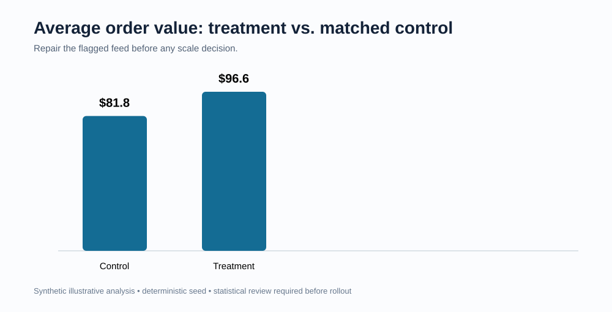
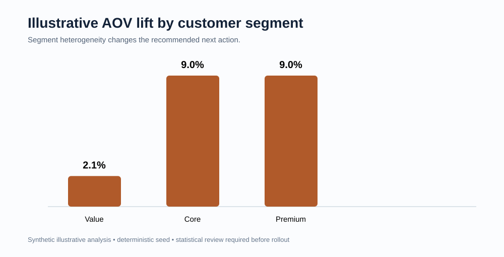

# Retail Test & Learn Experiment Pack

## Motivation
Retail teams can mistake a descriptive sales change for an experiment result. A reliable Test & Learn workflow makes the treatment, matched control, outcome definition, and data-feed health visible before a rollout decision.

## What this project is
A reproducible analytical pack for an illustrative targeted-offer test across matched store cells. It joins store, customer, assignment, transaction, and feed-validation records into a decision-ready readout.

## Why this problem matters
Pricing, promotion, and customer-engagement choices can affect sales, margin, and customer experience differently by segment. Leaders need concise action guidance; analytics, IT, and a test vendor need an auditable method and clean data contract.

## Data and evidence used
The six source-style CSV tables are deterministic synthetic data, documented in [data_dictionary.md](data_dictionary.md). They contain over 10,000 rows across 8 stores, 8 weeks, 200 customer records, and 10,240 transaction records. They are illustrative only, not company or vendor data.

## How the project works
The build script creates source tables, a segmented outcome rollup, a feed-health exception, and rendered evidence. [analysis_plan.md](analysis/analysis_plan.md) defines decision gates; [sql_checks.sql](analysis/sql_checks.sql) provides SQLite-compatible validation queries.

## Outputs and findings


The overall illustrative pattern requires data-feed repair before it can support a scale decision.



The segment view supports a differentiated next step: validate Core/Premium for potential expansion and revise the Value proposition.

## Recommendations
Repair or exclude the incomplete S06/week-4 feed, rerun a vendor-approved matched-control analysis with confidence intervals and power, then make a segment-aware expansion decision with margin guardrails. See [executive findings](analysis/executive_findings.md).

## Repository structure
```
data/        source-style tables
analysis/    plan, SQL validation, findings, generated outputs
scripts/     deterministic build script
docs/images/ rendered evidence embedded above
```

## How to run or inspect
Requires Python 3.11+ and no external packages:
```bash
python3 scripts/build_experiment_pack.py
```
Then inspect `analysis/outputs/`, run `analysis/sql_checks.sql` against the CSVs in a SQLite-capable workflow, and read the executive findings.

## Caveats and limitations
This is a synthetic illustration, not a production Test & Learn implementation or a statement of retailer performance. It does not substitute for pre-period balance, vendor control matching, confidence intervals, power calculations, causal review, or a complete data contract.
